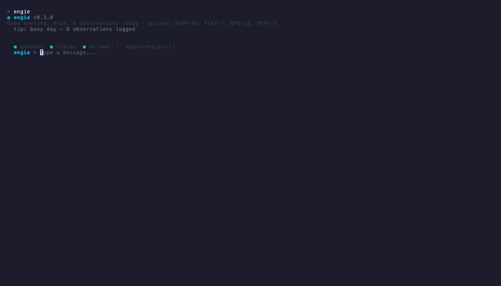
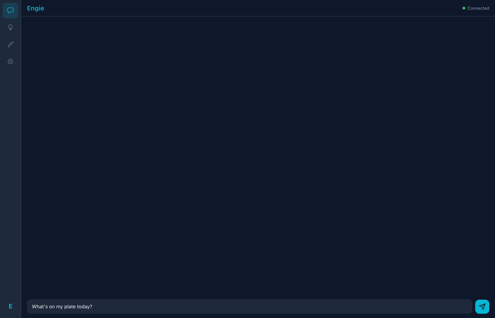
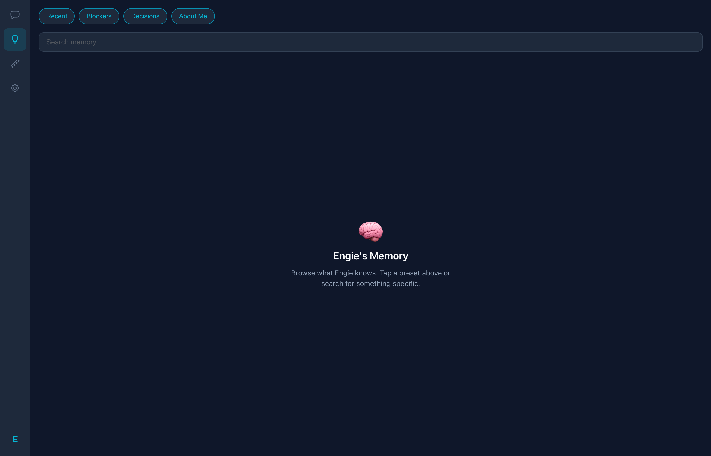

# CozyTerm

An AI assistant that lives in your terminal. It tracks your projects across Jira and GitHub, remembers what you've been working on, sends you morning briefs over Telegram, and handles coding tasks by routing them to either Claude or a local Ollama model depending on complexity.

Built with Bun. Runs natively on macOS with Apple Silicon GPU acceleration for local inference. Custom-built gateway — no third-party agent framework.

Heavy tasks (refactoring, multi-file edits, debugging) go through Claude Code using your existing Claude Pro/Max subscription — no extra API spend. Quick stuff (status checks, summaries, standups) runs locally on Ollama for free.

<p align="center">
  
</p>

<p align="center">
  
  
</p>

---

## Quick Start

```bash
# Install Bun if you don't have it
brew install oven-sh/bun/bun

# Clone and install
git clone https://github.com/engindearing-projects/engie.git
cd engie/cli && bun install

# Run the setup wizard — it handles the rest
bun run bin/cozy.mjs init
```

The wizard sets up the global `engie` command, installs Ollama, generates configs, installs MCP bridge dependencies, starts launchd services, and verifies everything connects.

---

## How to Use It

### Terminal (TUI)

```bash
engie
```

This opens the main interface. You get a chat window, a status bar showing service health, and a banner with context about what you've been working on. Press **Shift+Tab** to open the task panel — it shows your todos, active tool calls, and recent observations.

### One-shot from the command line

```bash
engie "what's the status of PROJ-42?"
engie "summarize yesterday's blockers"
```

Prints the answer and exits. Observations get captured automatically.

### Coaching mode

```bash
engie --coach
```

Friendlier explanations with analogies and plain language. Toggle it inside the TUI with `/coach`.

### Service management

```bash
engie status          # health check
engie doctor          # diagnostics
engie doctor --fix    # auto-repair common issues
engie start / stop    # manage launchd services
```

### Memory

Every conversation gets parsed for decisions, blockers, ticket references, and preferences. All of it goes into a local SQLite database with full-text search.

```bash
# Save something from the CLI
engie observe task_update "Finished API integration" --project myapp --tag PROJ-42

# Inside the TUI
/memory PROJ-42          # search
/memory                  # recent stuff
/observe need to follow up on IAM permissions
/todo add fix auth timeout on /login
/todo done obs_a1b2c3d4
```

### Web dashboard

A lightweight web UI for chatting with Engie and browsing memory from a browser. Connect it to the gateway and it works the same as the TUI — search memory, check service status, manage settings.

---

## Commands

| Command | What it does |
|---------|-------------|
| `/memory [query]` | Search memory or show recent |
| `/observe <text>` | Save a note to memory |
| `/todo [add\|done]` | Manage todos (Shift+Tab to see them) |
| `/status` | Service health |
| `/coach` | Toggle coaching mode |
| `/explain <topic>` | Friendly explanation of something |
| `/suggest` | Get next-step suggestions |
| `/forge [cmd]` | Training pipeline controls |
| `/clear` | Clear chat |
| `/help` | Full command list |

---

## How It Works

### Smart Router

Each message gets a complexity score (0-1). High-complexity tasks (code generation, refactoring, architecture) go to Claude Code via your subscription. Low-complexity tasks (status checks, summaries, quick questions) run locally on Ollama. You don't have to think about it — the router picks automatically.

### Memory System

Conversations are scanned for patterns:
- **Ticket references** — `PROJ-42`, `OPS-18`
- **Decisions** — "decided to", "going with"
- **Blockers** — "blocked by", "waiting on"
- **Preferences** — "always use", "prefer"
- **Completions** — "merged", "deployed", "done with"

Everything lands in `~/.cozyterm/memory/cozyterm.db` and gets surfaced in the TUI banner, cron briefs, and injected as context into conversations.

### Automated Briefs

Two cron jobs run on weekdays:
- **8:00 AM PT** — morning brief. Checks Jira boards, GitHub activity, and recent memory. Sends a summary to Telegram.
- **2:00 PM PT** — afternoon follow-up. Picks up Jira changes since morning and logs them.

### MCP Bridge

Engie exposes itself as an MCP server, so other tools (including Claude Code) can call into it:

`engie_chat`, `engie_observe`, `engie_claude`, `engie_route`, `engie_status`, `engie_system_status`, `engie_history`, `engie_sessions`, `engie_config`, `engie_raw`

Also connects to external MCP servers for **Jira**, **Slack**, and **Figma**.

---

## Services

Everything runs as launchd services and auto-starts on boot:

| Service | Port | What it does |
|---------|------|-------------|
| Gateway | 18789 | Custom WebSocket API |
| Claude Code Proxy | 18791 | Routes heavy tasks through `claude` CLI |
| Activity Sync | 18790 | Cross-platform activity ledger |
| Ollama | 11434 | Local LLM on Metal GPU |

---

## Configuration

Config lives in `~/.cozyterm/`. Copy the example config to get started:

```bash
cp config/gateway.json.example ~/.cozyterm/config/gateway.json
```

Fill in your Telegram bot token, gateway auth token, and optionally Slack credentials.

Key files:

| File | Purpose |
|------|---------|
| `~/.cozyterm/config/gateway.json` | Gateway config |
| `~/.cozyterm/config/.env` | API keys (never committed) |
| `~/.cozyterm/profile/user.json` | Your name, role, org |
| `~/.cozyterm/memory/cozyterm.db` | Memory database |
| `~/.cozyterm/cron/jobs.json` | Scheduled jobs |

Override the home directory with `COZYTERM_HOME` env var.

---

## Guardrails

- Won't push to main/master/prod without approval
- Won't deploy to production without approval
- Won't touch .env, terraform, or CI configs without approval
- Destructive commands are blocked by pre-execution hooks
- Max 5 PRs per day unless you ask for more

---

## Tech Stack

| | |
|---|---|
| **Runtime** | Bun (CLI), Node (MCP bridge) |
| **TUI** | Ink 5 + React 18 |
| **Gateway** | Custom WebSocket server |
| **Local LLM** | Ollama (Metal GPU) |
| **Heavy tasks** | Claude Code CLI (uses your subscription) |
| **Memory** | SQLite + FTS5 |
| **Web** | Vite + React + TypeScript |
| **Mobile** | React Native / Expo |
| **Messaging** | Telegram Bot API |

---

MIT — see [LICENSE](LICENSE).
